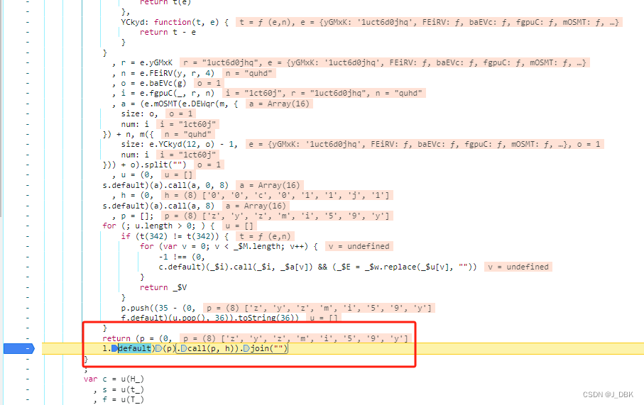
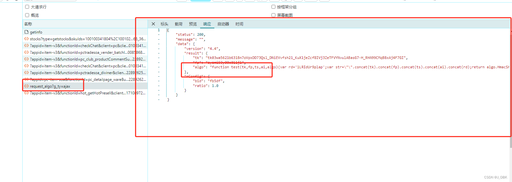
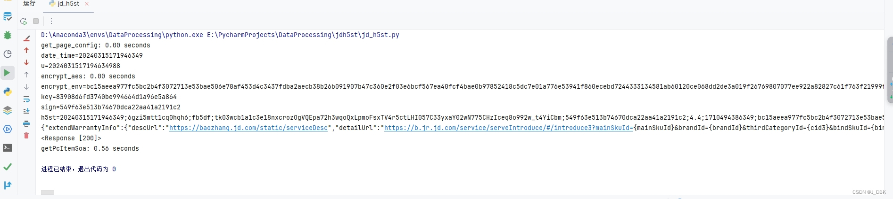

<h1>京东h5st 4.4算法分析 js_security_v3_0.1.8.js js_security_v3_main_0.1.8.js</h1>
京东h5st 4.4算法分析 仅供学习

这里请求获取商品的预约以及其他信息需要h5st （stock.js）
现在看下h5st如何获取

此处会vm加载一个js文件 js_security_v3_main_0.1.8.js 获取h5st的所有算法在里面

下面讲解几个关键位置

这里是获取_fingerprint 随机生成码  这里要把算法逆向一下  这里不是任意随机生成（本人亲测了，只能把算法给逆向出来）

这里的算法是获取 _fingerprint 用于获取algo 获取token 以及匿名js 方法 用于计算sign值

这里就是环境参数生成值然后请求algo

h5st

这里是环境参数加密

这里的key生成就是我们刚刚获取algo函数

结果图

请给我一个⭐ 感谢大家 fp做了优化版 方便大家理解 也可以想我那样把逆向扣写所需要的代码
会进行答疑

(jd_h5st.py)  python式 主文件入口 
python version 3.8
pip install -r requirements.txt
需求安装nodejs环境 18v-20v npm install crypto-js --save